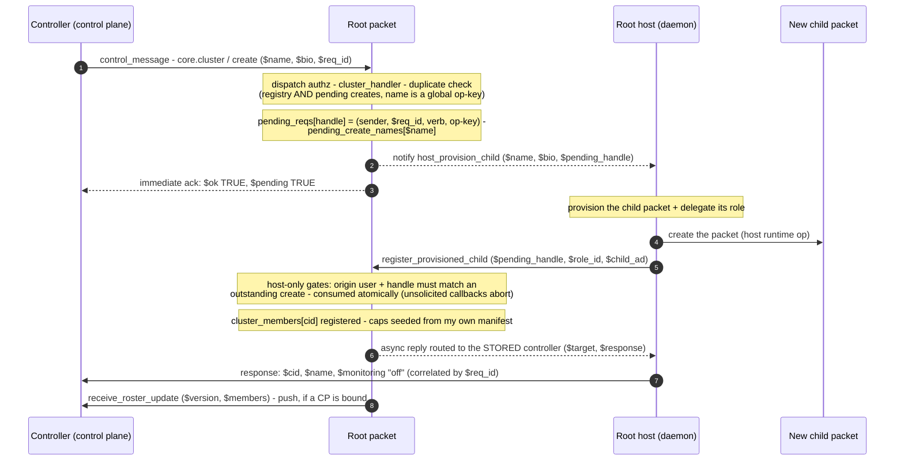
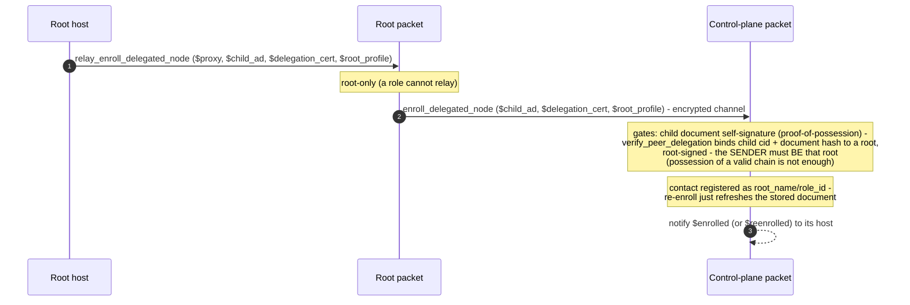

# Cluster lifecycle

`core.cluster` verbs manage hosted children (subagents) of a root identity. Operations that
need host work — provisioning a packet, destroying one, minting a child's invite, binding a
child's monitoring — are **asynchronous**: the verb handler validates, persists a pending
request keyed by a unique handle, emits a *host-primitive* notify to the local daemon, and
acknowledges `$pending` immediately. The daemon does the work and calls back a host-only
transaction that consumes the pending request and routes the real result to the original
controller.

Traced from [`a2a_cluster.mm`](https://github.com/adapt-toolkit/ours-mufl-core/blob/main/a2a_cluster.mm)
(`cluster_handler`, `register_provisioned_child`, `sweep_and_settle`, `reconcile`) and
[`a2a_messaging.mm`](https://github.com/adapt-toolkit/ours-mufl-core/blob/main/a2a_messaging.mm)
(`relay_enroll_delegated_node`, `handle_enroll_delegated_node`).

## Async child create

`remove` (destroy + `confirm_child_destroyed`), `contact` (mint the **child's** invite in the
child's own packet + `register_child_invite` — a root-minted invite would connect the caller to
the root, not the child), and `set_monitoring` (host-bind or host-clear the child's proxy +
`confirm_child_monitoring`) follow the same handle pattern with their own host primitives.

Two safety nets close the loop:

- **`reconcile`** — host truth joined with the registry: backfills children created
  out-of-band, drops members no longer hosted, preserves CP-authoritative fields (`$bio`,
  `$monitoring`) for existing members.
- **`sweep_and_settle`** — pending requests older than 120 s are settled: a create whose name
  now exists is adopted as success, otherwise timed out; an expired create also clears its
  global name key so a lost callback never leaves a name permanently un-creatable.

## Cluster enrollment (one root bind conveys the whole cluster)

The control plane holds `peer_ads` for every cluster member off a **single root bind**: the
root relays each child's public material; the child never participates.

## Per-child monitoring, derived — never named

On `set_monitoring` enable, the CP a child gets bound to is **derived from the root's own
ceremony-pinned `monitoring_proxy`** (`bound_cp_cid`), never taken from the request arguments —
so a child can only ever be bound to the CP its root actually ceremonied. The daemon first
host-injects the CP as a contact into the child (`host_register_monitoring_cp`, with the CP
document verified), because a network introduction would be rejected by the child's CP-only
acceptance gate and would race the ceremony. Disable host-clears the child's proxy and drops
the injected CP contact (`host_clear_child_monitoring`).

Roster changes (create, remove, bio/persona updates, monitoring flips, reconcile diffs) push a
sequenced snapshot to the bound CP — `receive_roster_update`, ingested on the CP side by the
`on_roster_update` hook (see
[`a2a_monitoring.mm`](https://github.com/adapt-toolkit/ours-mufl-core/blob/main/a2a_monitoring.mm)).
