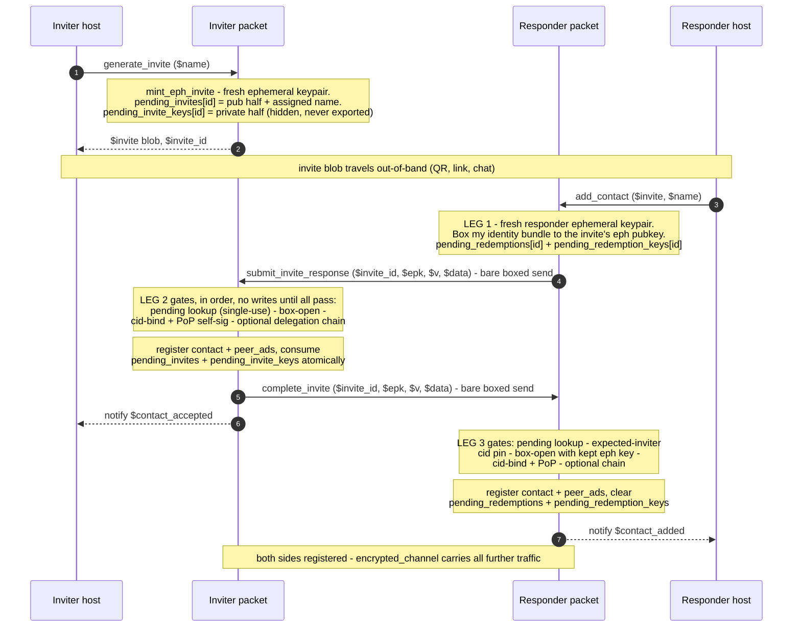

# Contact exchange (invite redeem)

Two strangers become mutual contacts through a **slim ephemeral-key invite** and a three-leg
redeem handshake. The invite blob itself carries no identity material — only an ephemeral
pubkey and correlation data (see [Invites & contacts](../how-it-works/invites-and-contacts.md)
for the invite shape). Identity bundles move inside boxes on legs 1 and 3, both of which are
**bare sends**: the two sides are not each other's contacts yet, so the encrypted channel
cannot carry them.

Traced from [`a2a_messaging.mm`](https://github.com/adapt-toolkit/ours-mufl-core/blob/main/a2a_messaging.mm)
(`generate_invite` / `mint_eph_invite`, `add_contact`, `handle_submit_invite_response`,
`handle_complete_invite`).

## Key properties visible in the flow

- **Single-use**: the first valid leg 2 consumes `pending_invites[id]` *and*
  `pending_invite_keys[id]` together. A replayed leg 1 aborts with `already-redeemed` and
  mutates nothing; a leg 1 that fails a gate (bad box, forged bundle) consumes nothing.
- **Disclosure order**: the responder discloses its identity first (leg 1); the inviter answers
  with its own bundle only after the responder's bundle verified (leg 3).
- **Why bare sends**: on leg 1 the inviter is not registered on the responder side (and vice
  versa on leg 3), so `send_encrypted_tx` could not resolve a source key. The box to the
  ephemeral key is the confidentiality; envelope signing plus the cid-bind and
  proof-of-possession checks are the authenticity.
- **Role invites**: when either side is a delegated role, its bundle also carries the delegation
  cert, root profile, and optional root-CP binding — verified with `verify_identity_bundle`, so
  each side learns the other's verified root linkage (`contact_roots`).

An invite can also be minted for a hosted child via the cluster `contact` verb — same
construction path (`mint_eph_invite`), see [Cluster lifecycle](./cluster.md).
