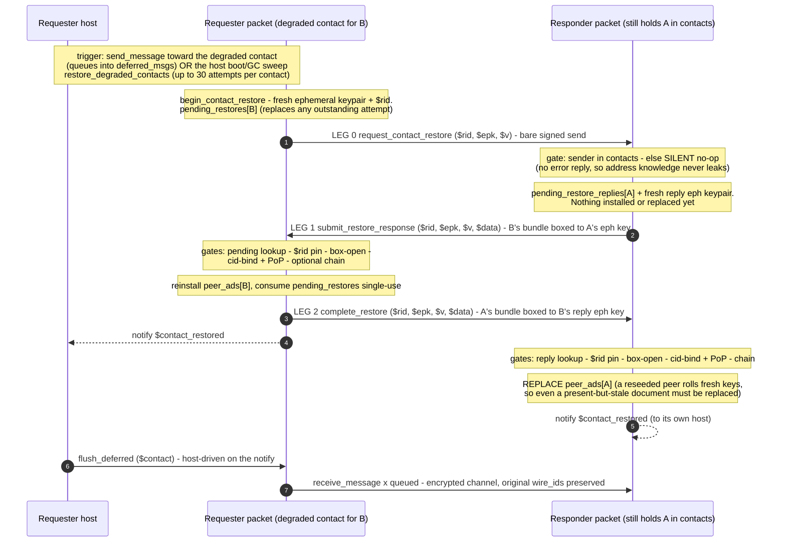

# Contact restore

A **degraded contact** is a cid present in `contacts` but missing from `peer_ads` — typically
after a breaking-change migration carried the contact but had to drop its address document.
Contact restore re-runs the key exchange between two *mutually known* addresses: the same
machinery as the invite legs (identity bundle, box to an ephemeral key, gates before any
write), but the trust anchor is "a signed request from an address already in my contacts"
instead of an out-of-band invite token.

Traced from [`a2a_messaging.mm`](https://github.com/adapt-toolkit/ours-mufl-core/blob/main/a2a_messaging.mm)
(`begin_contact_restore`, `handle_request_contact_restore`, `handle_submit_restore_response`,
`handle_complete_restore`, `flush_deferred`, `restore_degraded_contacts`).

## Why the pieces are shaped this way

- **Leg 0 is unboxed** (just `$rid`, an ephemeral pubkey, and a scheme id): there is nothing
  secret to carry yet, and the framework signs every envelope, so the responder authenticates
  the requester from the envelope alone.
- **Silent no-op for strangers**: a request from an address not in `contacts` returns success
  with no actions — whether an address is known never leaks.
- **The flush is host-driven**, not automatic: firing `flush_deferred` on the
  `$contact_restored` notify means the encrypted sends can never race the restore legs' bare
  sends on the wire.
- **Retry budget**: the host sweep re-fires on its GC cadence, up to `restore_max_attempts`
  (30) per contact; a peer that upgraded and came back online answers on the first
  post-upgrade attempt. Each re-mint supersedes the previous ephemeral key, so a stale leg-1
  reply fails both the `$rid` check and the unbox.
- **Observability**: `list_degraded_contacts` and `list_deferred_queues` are the readonly
  views the host sweep keys off.

This flow is what makes contacts survive breaking changes — see the migration contract in
[Versioning](../how-it-works/versioning.md).
