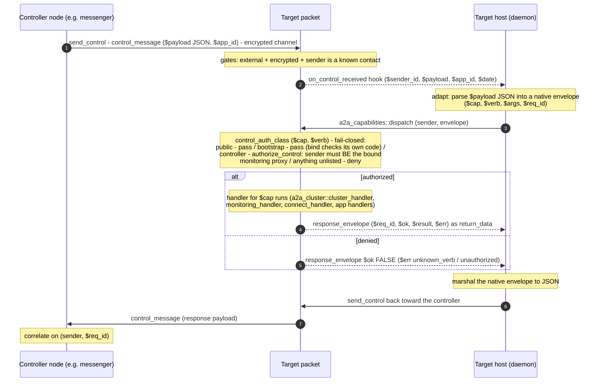

# Control-plane verb calls

All capability verbs — configuration, monitoring, connect, cluster — ride **one** transport
transaction (`a2a_control`'s `control_message`) carrying a typed envelope
`($cap, $verb, $args, $req_id)`. The receiving side routes it through a single dispatch
chokepoint with a fail-closed authorization table. MUFL has no JSON codec, so the daemon
adapts JSON to native records on the way in and marshals the native response envelope back to
JSON on the way out — generically, with no per-verb logic in the host.

Traced from [`a2a_control.mm`](https://github.com/adapt-toolkit/ours-mufl-core/blob/main/a2a_control.mm)
(`send_control`, `control_message`),
[`a2a_capabilities.mm`](https://github.com/adapt-toolkit/ours-mufl-core/blob/main/a2a_capabilities.mm)
(`dispatch`, `control_auth_class`), and
[`a2a_messaging.mm`](https://github.com/adapt-toolkit/ours-mufl-core/blob/main/a2a_messaging.mm)
(`authorize_control`).

## The authorization classes

`control_auth_class` is a pure table in the lowest layer; the stateful half
(`authorize_control`, which reads the hidden `monitoring_proxy`) is wired in at init and
enforced *inside* `dispatch`, so an app cannot wire routing while forgetting the gate — a
controller-class verb with no authorizer wired aborts.

| Class | Verbs | Who may call |
|-------|-------|--------------|
| `public` | none via dispatch (`get_manifest` is a standalone readonly transaction, never routed through dispatch) | anyone |
| `bootstrap` | `core.monitoring` / `bind` | whoever presents the 6-digit code (pre-bind by definition) |
| `controller` | the explicit list: `core.cluster` verbs, `core.monitoring` / `disable`, `core.connect` / `introduce`, `core.configuration` `get_config` / `set_config` | only the bound control plane |
| `deny` | everything else | no one — a new verb must be consciously classified to become reachable |

## Async verbs

Some cluster verbs cannot complete inside one transaction (provisioning a child takes host
work). Their handlers return an immediate `$pending` acknowledgment and the real result is
routed later by a host callback to the *stored* original controller — see
[Cluster lifecycle](./cluster.md) for that pattern.

## Configuration writes

`set_app_config` follows the same trust rule as every controller-class verb: external,
encrypted, sender must be the bound CP (`require_bound_cp_or_abort`). The blob is opaque to the
core — a `$config_updated` notify wakes the host wrapper, which pulls it via `get_app_config`
and applies the operational parts. See
[Capabilities & control](../how-it-works/capabilities-and-control.md) for the envelope types
and manifest shape.
