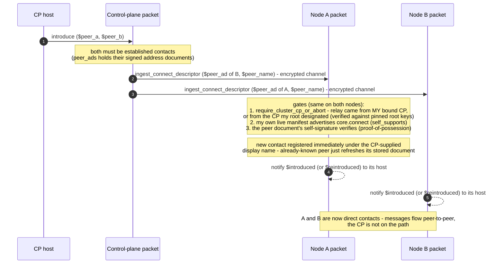

# Introductions (core.connect)

A control plane bound to **both** parties can connect two nodes without a new out-of-band
invite: it already holds each managed node's self-signed address document (captured in
`peer_ads` when the node was established as its contact), so an introduction is simply sending
each node the *other's* signed document. There is no SAS and no confirmation step — the
bound-CP channel is the authorization, and the node-side capability gate is the authoritative
"do I accept introductions".

Traced from [`a2a_messaging.mm`](https://github.com/adapt-toolkit/ours-mufl-core/blob/main/a2a_messaging.mm)
(`introduce`, `introduce_to_group`, `emit_pair`, `handle_ingest_connect_descriptor`,
`require_cluster_cp_or_abort`).

## Variants and entry points

- **`introduce`** — the 1:1 pair, host-fired on the CP.
- **`introduce_to_group`** — fan-out: one joiner is introduced to every member of a list (the
  cluster-root case: a new subagent meets all existing ones). Same `emit_pair` relays, once per
  member, in a single transaction.
- **`core.connect` / `introduce` verb** — the same composition reached through the
  [control-envelope dispatch](./control-verbs.md) (`connect_handler`), so a remote controller
  can trigger it.

## Trust details

- The **CP-supplied display name is unauthenticated by design** — a receiver-chosen label. The
  document's self-signature is the only identity the receiver trusts; the cid is key-derived,
  so an existing contact's keys can never be silently overwritten by a different keyset.
- The gate accepts a relay on **either** of two grounds: the node ran the 6-digit ceremony
  itself (sender is its own `monitoring_proxy`), or — for cluster children — the sender is the
  CP the node's *root* designated, re-verified against the pinned root identity on every call
  (`root_cp_binding` + `root_ad`), with no per-child ceremony.
- The node-side manifest check makes "supports introductions" **enforced**, not advisory: a
  node whose manifest does not advertise `core.connect` rejects the relay regardless of who
  sent it. The CP-side pre-check (don't try to introduce a node that doesn't support it) is a
  courtesy the daemon performs via `get_manifest`.

For how a cluster child receives its CP contact in the first place (host-injected, not
network-introduced), see [Cluster lifecycle](./cluster.md).
