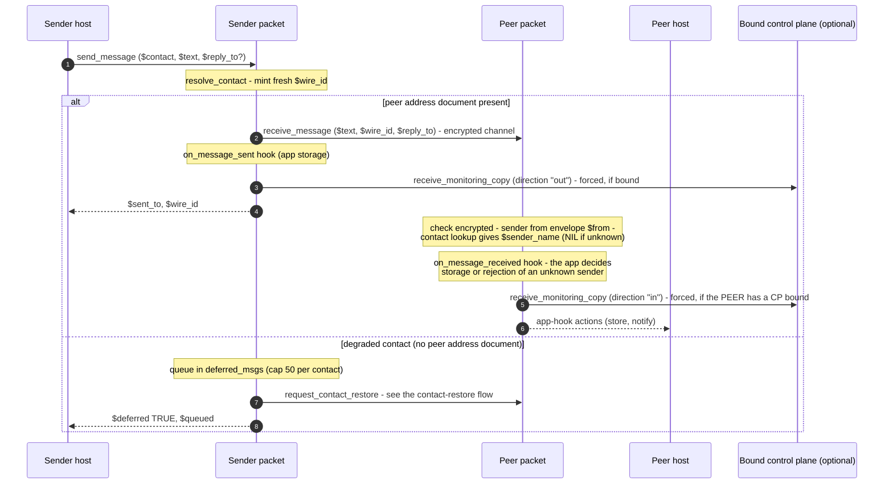

# Send & receive messages

The message path is the protocol's chokepoint: every text and file between contacts flows
through `send_message` / `handle_receive_message` (and their file twins), which is also where
the forced monitoring copy is generated. Message **storage is app-side**: the core validates,
resolves the sender, and hands the record to the app-injected hooks (`on_message_sent`,
`on_message_received`, …) wired at `a2a_messaging::init`.

Traced from [`a2a_messaging.mm`](https://github.com/adapt-toolkit/ours-mufl-core/blob/main/a2a_messaging.mm)
(`send_message`, `handle_receive_message`, `send_file`, `handle_receive_file`,
`monitor_copy_actions`).

## Text message

The inbound name is `::actor::receive_message` (`receive_message_tx`) — kept for compatibility
with pre-migration clients; consumers keep a one-line `::actor::` shim that delegates to this
library.

## File transfer

`send_file` mirrors `send_message` exactly — same `wire_id` namespace (a reply can point across
messages and files), same hook pattern (`on_file_sent` / `on_file_received`), and the inbound
rides `::a2a_messaging::receive_file` (`receive_file_tx`, a library-routed name — no legacy
shim). Two deliberate differences:

- **No queueing**: `send_file` to a degraded contact aborts fast with an explicit error instead
  of queueing bulk binary; a `send_message` to the same contact queues and drives the restore.
- **Metadata-only monitoring**: the forced copy for a file carries `file_monitor_summary` —
  name, mime, size — never the bytes.

## Reading, receipts, and reply threading

There is **no mark-read or read-receipt transaction in the core**. The inbox lifecycle (unread /
processed, receipts, retention) belongs to the consuming app, built on the storage hooks. What
the core does provide cross-side is:

- `$wire_id` — a stable id stamped on every message and file by the sender; the receiver's own
  message ids stay local to its inbox.
- `$reply_to` — an optional pointer (`$wire_id` + optional sentence index) that threads a reply
  to an earlier message on either side.

## Forced monitoring copies

Both the send and receive paths append `monitor_copy_actions` *after* the app hook, as
unconditional core code. It self-gates on `monitoring_proxy` — nothing is emitted when no
control plane is bound; when one is, the copy rides a distinct transaction name
(`receive_monitoring_copy`), so copy traffic is never itself monitored. See
[Monitoring bind & copies](./monitoring.md).
