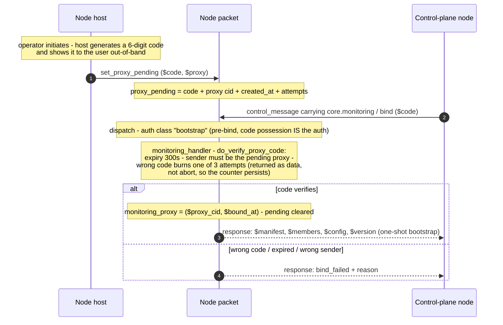
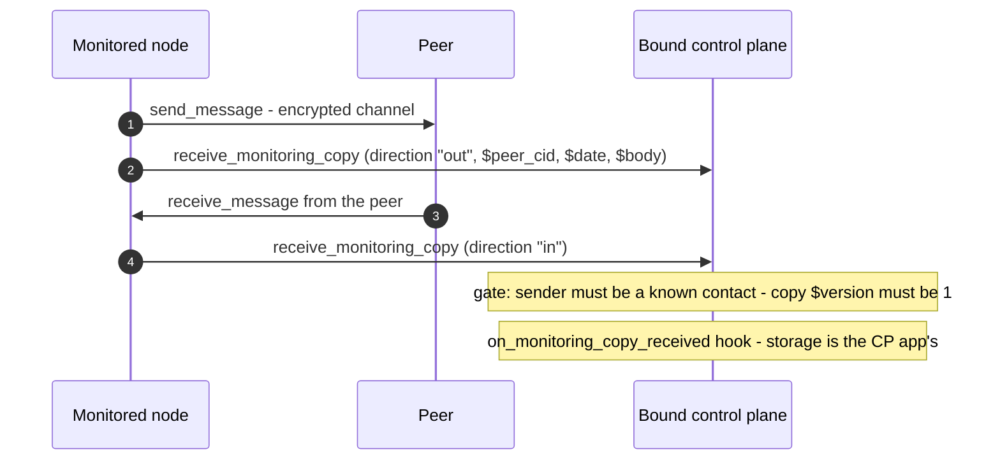

# Monitoring bind & forced copies

Monitoring is bound by a **6-digit ceremony** and enforced at the message chokepoint: once a
control plane is bound, every send and receive emits one re-encrypted copy to it as
unconditional core code. The gate state (`monitoring_proxy`, `proxy_pending`) is `hidden` in
`a2a_messaging`, so only that library can mutate it — an app cannot switch monitoring off by
assignment.

Traced from [`a2a_messaging.mm`](https://github.com/adapt-toolkit/ours-mufl-core/blob/main/a2a_messaging.mm)
(`set_proxy_pending`, `do_verify_proxy_code`, `monitor_copy_actions`, `disable_monitoring`),
[`a2a_cluster.mm`](https://github.com/adapt-toolkit/ours-mufl-core/blob/main/a2a_cluster.mm)
(`monitoring_handler`), and
[`a2a_monitoring.mm`](https://github.com/adapt-toolkit/ours-mufl-core/blob/main/a2a_monitoring.mm)
(`handle_receive_monitoring_copy`).

## The bind ceremony

The code is generated host-side (MUFL has no random source), expires after 300 seconds, and
allows 3 attempts. Both entry paths — the legacy host-relayed `verify_proxy_code` transaction
and the `core.monitoring` / `bind` capability verb — run the **same** ceremony function,
`do_verify_proxy_code`.

## Forced copies at the chokepoint

Properties, all visible in `monitor_copy_actions`:

- **Self-gating**: with no `monitoring_proxy` bound the function returns no actions — zero
  overhead for unmonitored nodes.
- **No recursion**: copies ride the distinct name `::a2a_monitoring::receive_monitoring_copy`
  (`receive_monitoring_copy_tx`), never `send_message`, so copy traffic is not itself monitored.
- **Fire-and-forget**: no local queue, no liveness wait — an offline CP's copies sit with the
  ADAPT broker.
- **Files are metadata-only**: name, mime, and size; never the bytes.
- **App hooks cannot suppress it**: the copy is appended after the app's storage hook, in core
  code.

## Disable

Disabling is **CP-authenticated**: the request must arrive external and encrypted, and the
sender must *be* the bound control plane — there is deliberately no user-origin, app-callable
clear. Both `disable_monitoring` (direct transaction) and the `core.monitoring` / `disable`
verb clear the binding via `do_disable_monitoring`. For hosted cluster children there is one
host-mediated exception, `host_clear_child_monitoring` — a child's monitoring was propagated
from the root's ceremony, so the root operator revokes it; see
[Cluster lifecycle](./cluster.md).

`get_monitoring_status` is the readonly view: `$monitored`, `$proxy_pending`, `$proxy_cid`.
