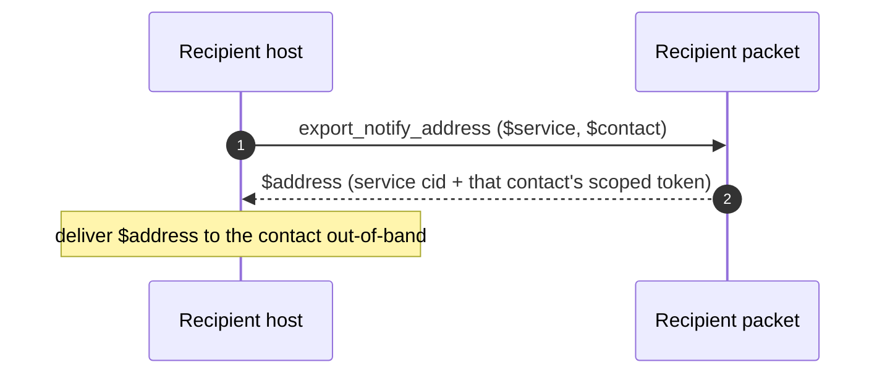
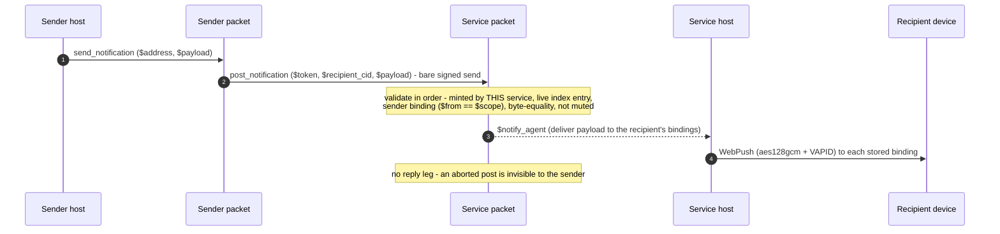

# Notifications

The notification path lets a **sender** wake a **recipient's** device without being able to
read anyone else's traffic. A recipient registers WebPush bindings with a notification
**service** and asks it to mint one **scoped token** per contact; each contact receives only its
own handout (`service cid + its scoped token`). A sender posts with that token as a **bare signed
send** — the service is typically a packet it has never met — and the service validates the token,
checks the sender binding and the receive-mute flag, then hands the payload to its host, which
does the WebPush egress. There is **no reply leg**: an aborted post is invisible to the sender, so
a mute is unprobeable.

Traced from
[`a2a_notifications.mm`](https://github.com/adapt-toolkit/ours-mufl-core/blob/main/a2a_notifications.mm)
(`notify_register`, `notify_issue_tokens`, `export_notify_address`, `send_notification` →
`post_notification`, `notify_mark_read`, `notify_set_sender_muted`, `notify_rotate_token`,
`notify_revoke_contact_tokens`).

## Register and issue per-contact tokens

The recipient registers over the encrypted channel (the service is a normal contact of the
recipient), then asks the service to mint a scoped token for each of its contacts.

```mermaid
sequenceDiagram
    autonumber
    participant RH as Recipient host
    participant R as Recipient packet
    participant NS as Service packet
    participant NSH as Service host

    RH->>R: notify_register ($service, $bindings)
    R->>NS: register ($bindings) - encrypted channel
    Note over NS: store registration + WebPush bindings
    NS->>R: confirm_registration ($ok) - encrypted channel
    Note over R: registration confirmed (app state)

    RH->>R: notify_issue_tokens ($service, $contacts)
    R->>NS: issue_tokens ($contacts) - encrypted channel
    Note over NS: mint one scoped token per (recipient, sender);<br/>idempotent, re-issue keeps the existing token
    NS->>R: confirm ($sender_tokens) - the per-contact map
    Note over R: my_notify_contact_tokens updated
```

## Hand a contact its notification address

The recipient exports the per-contact handout and delivers it to that contact out-of-band (in the
reference stack, over the normal messaging channel).



## Send a notification

The sender holds the recipient's handout and posts a bare signed send. The service validates and
never replies.



## Read, mute, rotate, revoke

Runtime management from the recipient. Muting is a runtime flag only (the token is unchanged
across a mute/unmute cycle); rotation replaces one sender's slot or all of them (a panic button);
revocation drops the index entry and the slot with no re-mint, so old handouts abort at the index
lookup.

```mermaid
sequenceDiagram
    autonumber
    participant RH as Recipient host
    participant R as Recipient packet
    participant NS as Service packet

    RH->>R: notify_mark_read ($service, $notif_ids)
    R->>NS: mark_read ($notif_ids)

    RH->>R: notify_set_sender_muted ($service, $contact, $muted)
    R->>NS: set_sender_muted ($sender, $muted)
    Note over NS: runtime-only; token unchanged

    RH->>R: notify_rotate_token ($service, $contact?)
    R->>NS: rotate_token ($sender?) - one slot, or all (panic button)

    RH->>R: notify_revoke_contact_tokens ($service, $contacts)
    R->>NS: revoke_sender_tokens ($senders)
    Note over NS: delete index entry + slot, no re-mint;<br/>old handouts abort at the index lookup
```
